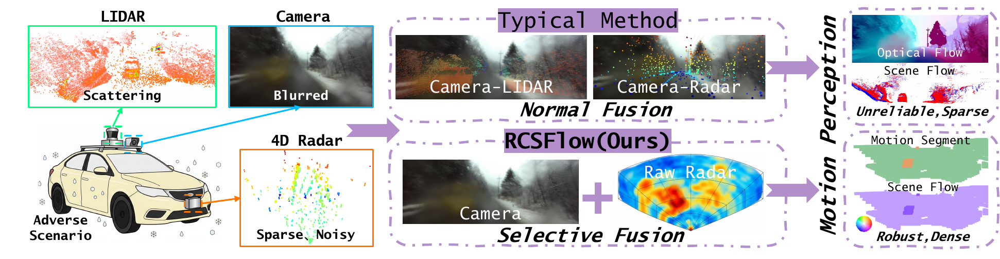
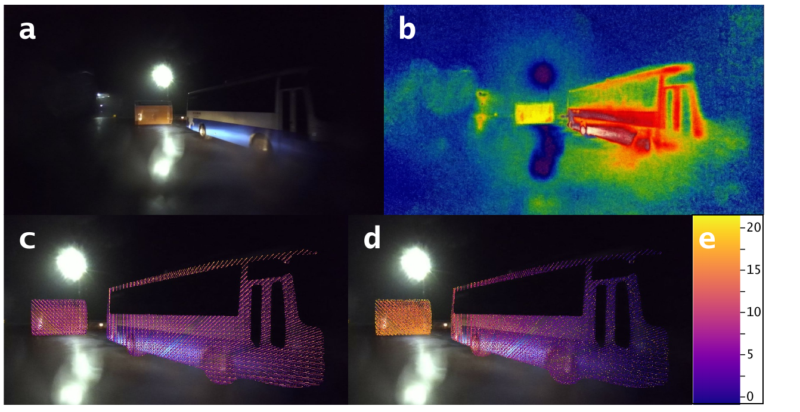
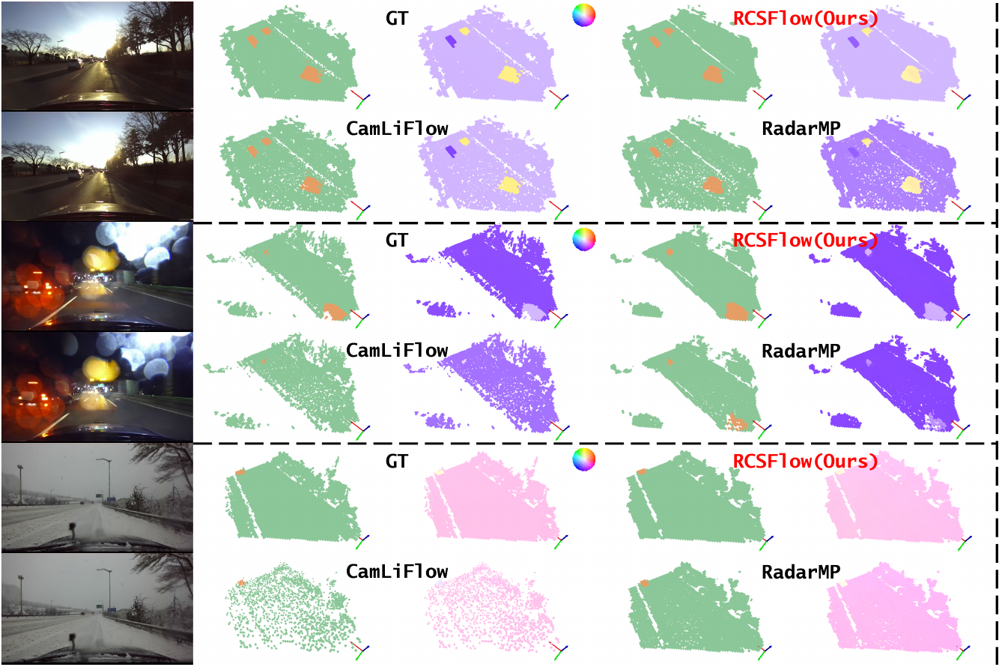
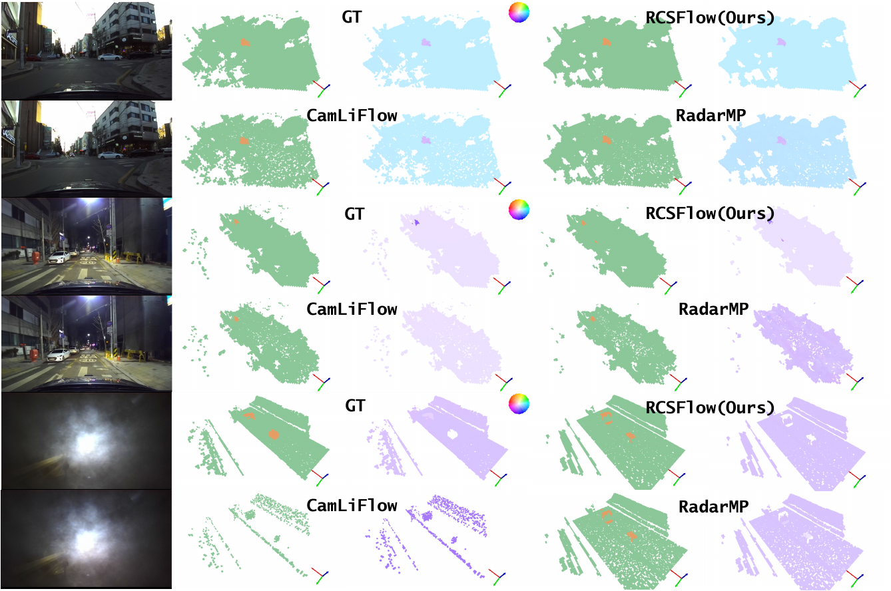
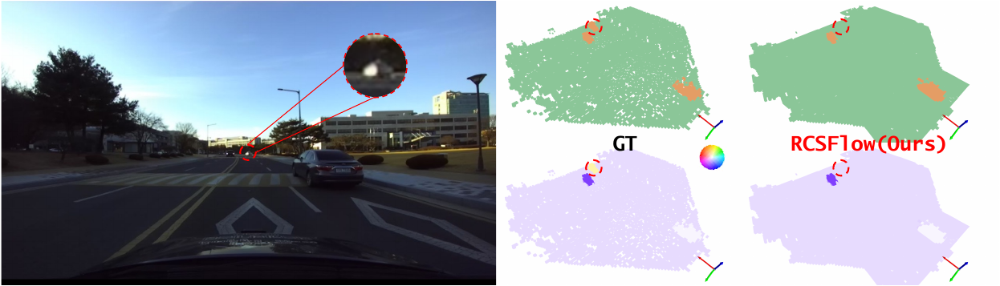

# Selective Fusion of Raw Radar and Camera for Robust Motion Perception with a Bidirectional BEV-to-3D Architecture

**Accepted by ACM Multimedia 2026 (ACM MM '26) — Oral Presentation**

Ruiqi Cheng, Huijun Di, Jian Li, Feng Liu, and Wei Liang

## Motivation

<p align="center">
  <a href="picture/rcsflow_teaser_final.pdf">
    
  </a>
</p>

*Our proposed RCSFlow combines temporally synchronized adjacent image frames with raw radar measurements using a novel selective fusion mechanism that enables dense, robust scene motion perception, remaining reliable and accurate under adverse conditions where single modalities and conventional multimodal fusion methods degrade.*

<p align="center">
  <a href="picture/motivation.pdf">
    
  </a>
</p>

***Motivation schematic.*** *(a) Degraded image captured in a sleet, nighttime parking scenario. (b) Selective confidence heatmap over image features predicted by RCSFlow. (c) Intensity-weighted depth projection of raw radar tesseract echoes corresponding to high-confidence image regions. (d) Selective radar feature depth projection by RCSFlow to resolve pixel collisions. (e) Depth colorbar. By fusing reliable visual and unambiguous radar features via feature selection, RCSFlow identifies stable sensing cues and enables robust motion perception under adverse conditions.*

Click each figure to view the original PDF.

## Dataset preprocessing
>Please follow the steps below to prepare and preprocess the dataset we used.
### 1. Obtain [K-Radar](https://github.com/kaist-avelab/K-Radar) dataset
### 2. Obtain [Radelft](https://github.com/RaDelft/RaDelft-Dataset) dataset

## Environment Installation
>Note: our code has been tested on Ubuntu 18.04/20.04 with Python 3.10, CUDA 11.8/12.4, PyTorch 2.1/2.4. It may work for other setups, but has not been tested.
### 1. Create Conda Environment
```bash
conda create --name rcsflow python=3.10 -y
conda activate rcsflow
```
### 2. Install PyTorch with CUDA 
```bash
conda install pytorch==2.4.0 torchvision==0.19.0 torchaudio==2.4.0  pytorch-cuda=11.8 -c pytorch -c nvidia
```
### 3. Install Additional Requirements
```bash
pip install -r requirement.txt
```
### 4. Install other library
```bash
# install spconv
pip install spconv-cu118

cd Lib/deform_attn_2d   #  Deformable DETR: Deformable Transformers for End-to-End Object Detection. https://github.com/fundamentalvision/Deformable-DETR 
sh ./make.sh      
cd Lib/deform_attn_3d/  #  VoxFormer: a Cutting-edge Baseline for 3D Semantic Occupancy Prediction. https://github.com/nvlabs/voxformer
python setup.py build_ext --inplace
cd Lib/corr_2d/         #  PWC-Net: CNNs for Optical Flow Using Pyramid, Warping, and Cost Volume. https://github.com/NVlabs/PWC-Net/tree/master
python setup.py install
# download from https://github.com/fbcotter/pytorch_wavelets
conda install -c conda-forge pywavelets
cd Lib/pytorch_wavelets/
pip install .
```
## Model Training
>Make sure you have successfully completed all above steps before you start running code for model training.

### 1. Annotation Generation
```bash
cd Toolkits
python trans_kradar_2_rcofdata.py
```
### 2. Training
To train our RCSFlow models, please run:
```bash
python train.py
```

## Model Evaluation
To evaluate the trained RCSFlow models on the test set, please run:
```bash
python test.py
```

## Results

<p align="center">
  <a href="picture/rcsflow_result_final.pdf">
    
  </a>
</p>

*Qualitative results of RCSFlow. Click the figure to view the original PDF.*

<p align="center">
  <a href="picture/supp01.pdf">
    
  </a>
</p>

*Additional qualitative results. Click the figure to view the original PDF.*

### Limitations

<p align="center">
  <a href="picture/failure_case_seq16_frame34.pdf">
    
  </a>
</p>

*A representative failure case from Sequence 16, Frame 34. Click the figure to view the original PDF.*

## Citation

If you find this work useful, please cite:

```bibtex
@inproceedings{cheng2026selective,
  author    = {Ruiqi Cheng and Huijun Di and Jian Li and Feng Liu and Wei Liang},
  title     = {Selective Fusion of Raw Radar and Camera for Robust Motion Perception with a Bidirectional {BEV}-to-{3D} Architecture},
  booktitle = {Proceedings of the 34th ACM International Conference on Multimedia},
  series    = {MM '26},
  year      = {2026},
  month     = nov,
  location  = {Rio de Janeiro, Brazil},
  publisher = {Association for Computing Machinery},
  address   = {New York, NY, USA},
  numpages  = {9},
  doi       = {10.1145/3767308.3835143},
  url       = {https://doi.org/10.1145/3767308.3835143}
}
```
